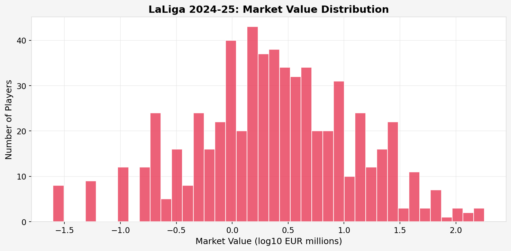
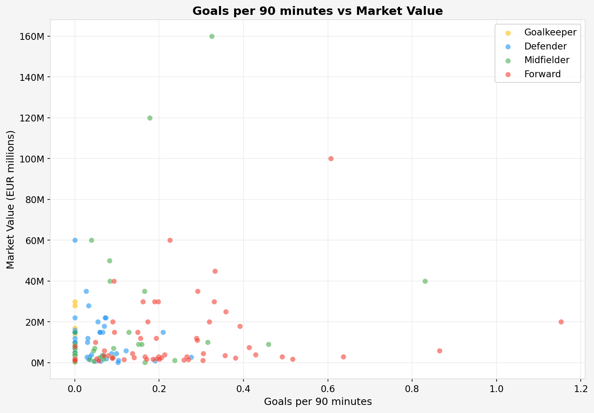
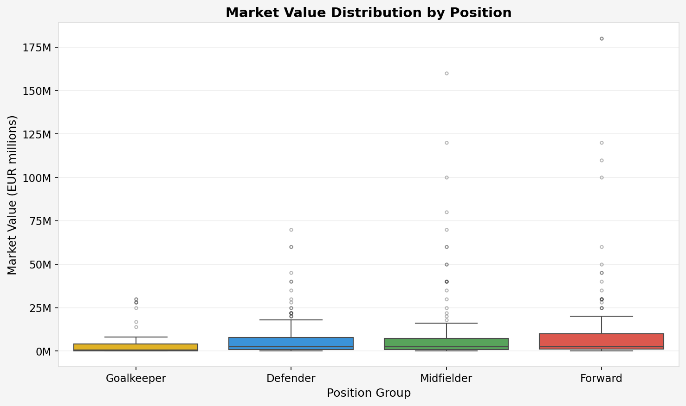
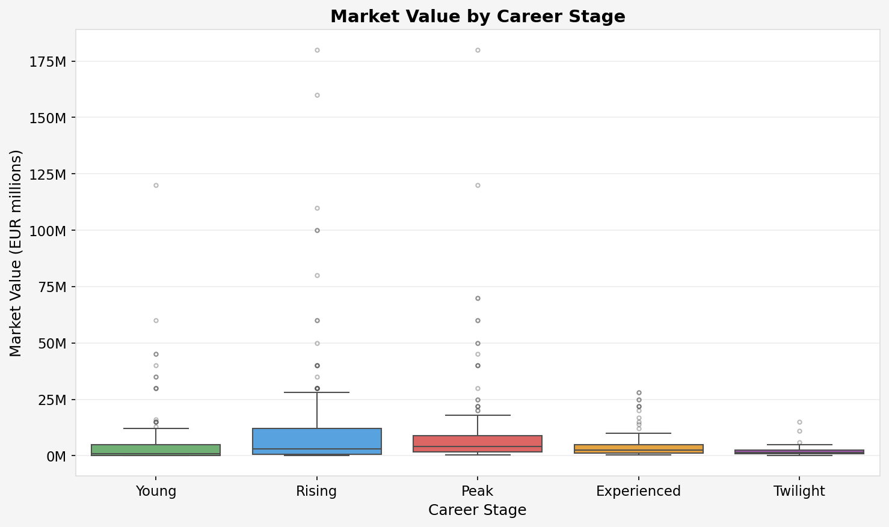
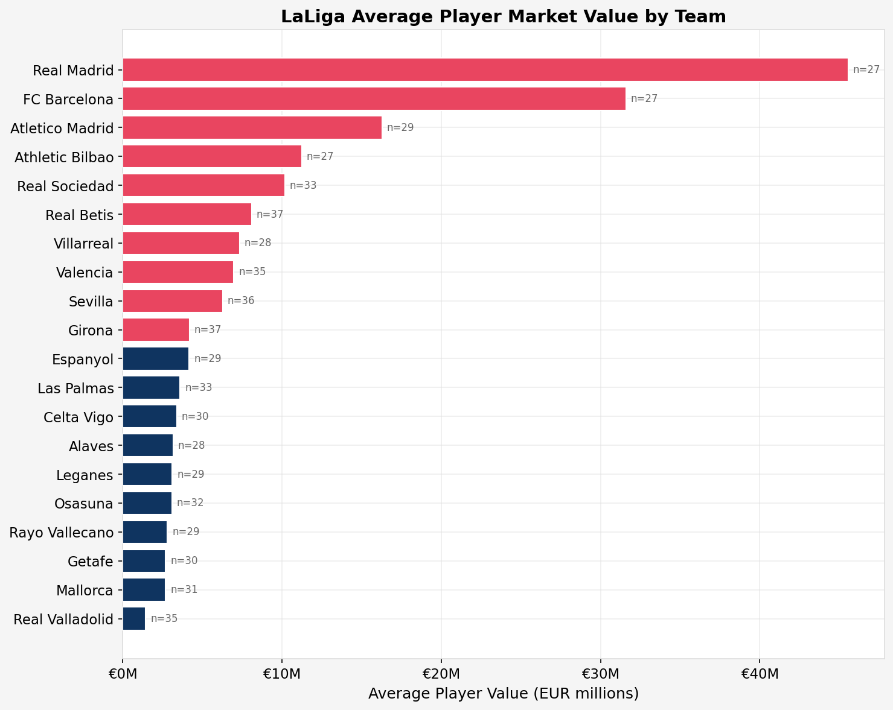
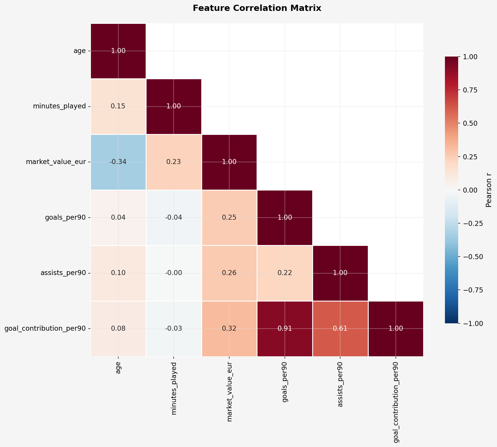
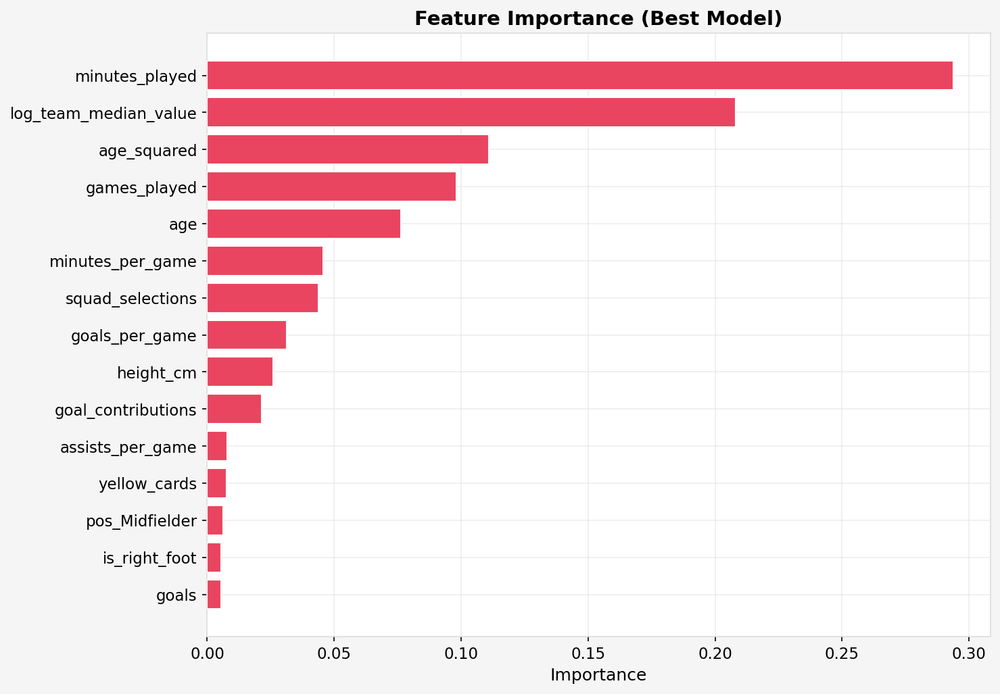
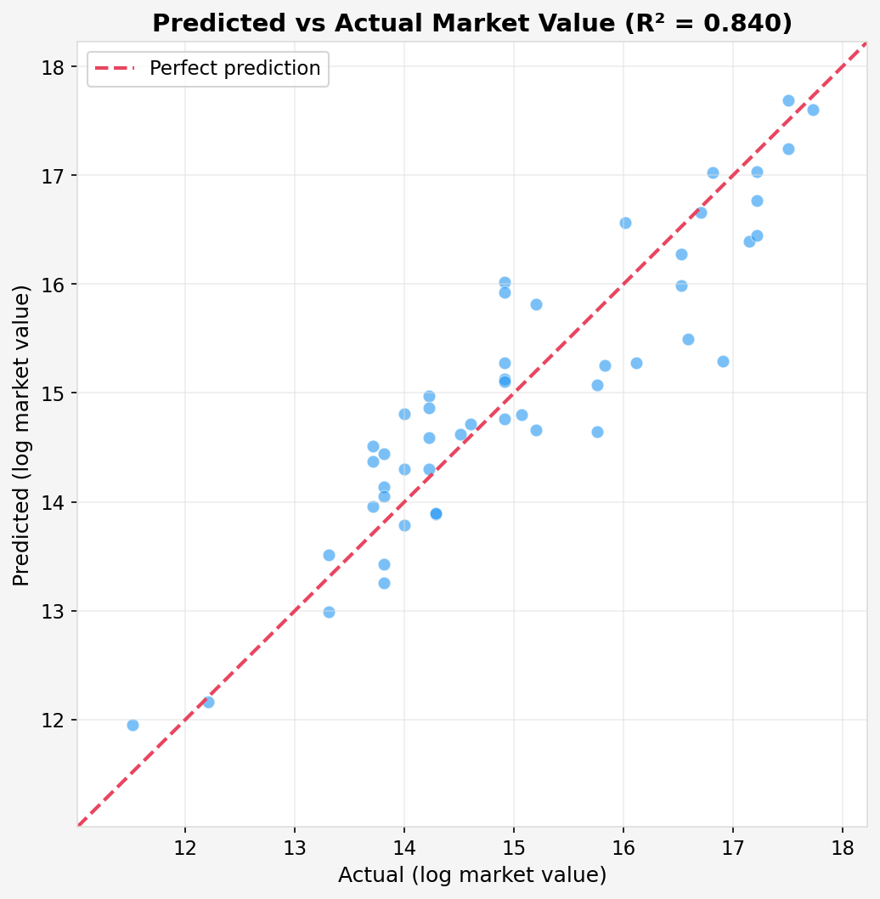

# LaLiga Player Performance & Market Value Analytics

A data analytics project exploring the relationship between player performance metrics and market valuations across LaLiga (2024-25 season) using **real Transfermarkt data**. Built from the complete [transfermarkt-datasets](https://github.com/dcaribou/transfermarkt-datasets) — **622 players across all 20 teams** with full matchday squad rosters, market valuations, and appearance statistics. This project applies exploratory data analysis, feature engineering, and machine learning to uncover what truly drives a footballer's market value in Spain's top division.


---

## Key Findings

1. **Minutes played is the strongest predictor of market value** (29.4% feature importance). Consistent starters command far higher valuations — regular playing time signals trust from the manager and reliability.

2. **Team prestige is the second-most important driver** (20.8%). Adding a squad-level median value proxy as a feature demonstrates that the *shirt a player wears* matters almost as much as what they do on the pitch.

3. **Gradient Boosting achieves R² = 0.84** — significantly outperforming Random Forest (0.76) and Ridge Regression (0.68). Non-linear interactions between age, team context, and playing time are critical. GB's sequential error-correction captures nuances that simpler models miss.

4. **The model reveals genuinely interesting mispricings.** Players like Takefusa Kubo (€30M actual, €13.9M predicted) are "undervalued" by the model — their market value reflects reputation and potential beyond raw on-pitch output this season.

---

## Technologies Used

| Category | Tools |
|---|---|
| **Language** | Python 3.10+ |
| **Data Source** | [Transfermarkt](https://www.transfermarkt.com/) via [transfermarkt-datasets](https://github.com/dcaribou/transfermarkt-datasets) |
| **Data Manipulation** | pandas, NumPy |
| **Machine Learning** | scikit-learn (Random Forest, Gradient Boosting, Ridge Regression) |
| **Visualization** | Matplotlib, Seaborn |
| **Environment** | Jupyter Notebook |

---

## Project Structure

```
football-analytics-project/
├── README.md
├── requirements.txt
├── .gitignore
├── data/
│   └── laliga_players_2024_25.csv     # Real Transfermarkt data (622 players, 20 teams)
├── images/                             # Auto-generated plot PNGs
├── notebooks/
│   ├── 01_data_exploration.ipynb       # EDA: distributions, correlations, visual analysis
│   └── 02_predictive_model.ipynb       # ML: feature engineering, model training, evaluation
└── src/
    ├── data_collection.py              # Data loading & cleaning (Transfermarkt source)
    ├── feature_engineering.py          # Per-90 metrics, age buckets, composite indices
    └── visualization.py               # Reusable plotting functions for football analytics
```

---

## How to Run

### 1. Clone the repository
```bash
git clone https://github.com/JuanseMarcial/laliga-player-market-value-analytics.git
cd laliga-player-market-value-analytics
```

### 2. Create a virtual environment and install dependencies
```bash
python -m venv venv
source venv/bin/activate  # On Windows: venv\Scripts\activate
pip install -r requirements.txt
```

### 3. Run the notebooks
The dataset (`data/laliga_players_2024_25.csv`) is included in the repo — real Transfermarkt data for the 2024-25 season.
```bash
jupyter notebook notebooks/
```
- Start with `01_data_exploration.ipynb` for EDA
- Then run `02_predictive_model.ipynb` for the predictive modeling pipeline

---

## Sample Visualizations

### Market Value Distribution


### Goals vs Market Value


### Market Value by Position


### Value by Age Bucket


### Squad Values by Team


### Correlation Heatmap


### Feature Importance (Best Model)


### Predicted vs Actual Market Value


---

## Future Work

- Incorporate event-level data (xG, xA, progressive carries) for deeper performance modeling
- Add temporal analysis: how do market values evolve across transfer windows?
- Build an interactive Streamlit dashboard for club-level exploration
- Extend to multi-league comparison (LaLiga vs Premier League vs Serie A)

---

## Author

**Juan Sebastian Marcial**
Data & Business Analytics — IE University
[GitHub](https://github.com/JuanseMarcial) | [LinkedIn](https://www.linkedin.com/in/juan-sebastian-marcial-piedra)

---

## License

This project is licensed under the MIT License. See `LICENSE` for details.
